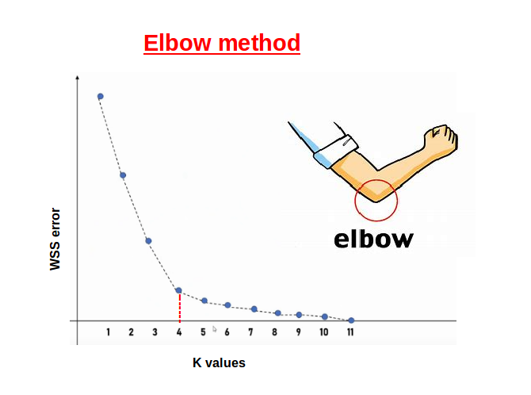

Normalization

Standardization

***

To move the outliers closer in, we can take the **log** of the distribution.
> still preserves relative 
> things far out are crunched down severely

Some machine learning models don't work well with categories. 
**Don't::do/dont** use IDs per category 
> implicitly assigns relationships to categories (eg nurse is half doctor, etc)

**One hot encoding** is a technique that transforms categorical variables by **assigning a column per category and 1 for matches and 0 for everything else** 

Downside of one hot encoding: dataset **explodes**. You can **bin categories** to avoid this.
> binning is taking a continuous feature and introducing a column that categorizes it

One hot encoding in pandas: **`pd.get_dummies(df, columns=['column1', 'column2'])`**

Binning on continuous features results in **categorical** data
> eg mpg for electric vs gas cars (electric will be at 0)

We want to bin manually when **there is a boundary condition not obvious in the data**. 
> GPA -> passing vs failing
> age -> child vs adult
> location -> county
> mpg -> car type

**Centroids** **take the "center of mass" of a cluster::effect**
Calculated by **taking a weighted average** 

**k-means** is a(n) **unsupervised::supervised/unsupervised** learning algorithm that **groups data points into k clusters based on their features**.
> begin with $k$, how many clusters you expect
> the algorithm will assign each point to a cluster
> algorithm randomly starts, then converges

**Unsupervised** learning is an attempt to find structure in unlabeled data.

k-means process 
1. **pick $k$ random points**
2. assign every point to the closest of chosen points
3. once we have our categories **find the centers of these categories**
4. assign every point to the closest of the new Centroids
5. find new centers
> $J = \sum_{i=1}^{k} \sum_{j=1}^{n} ||x_j - \mu_i||^2$

A clear number of clusters produces a graph like
{{c1::

}}

**Hierarchical** clustering is more likely to converge correctly compared to k-means 
> gives a dendrogram, which gives you a more complete picture of the dataset
> high time and space computational complexity (bad for large datasets)
> sensitive to noise and large clusters

PCA uses eigenvectors on a **covariance** matrix
> principal components are eigenvectors of matrix

Principal Component Analysis:
PCA benefits
**Dimension** Reduction
Noise reduction
Feature transformation
Visualization
**Feature** selection
> PCA reduces the number of features while retaining essential information, making datasets more manageable
> eliminates noise in data, improving feature quality and model performance 
> transforms original features into orthogonal components, potentially revealing hidden patterns
> PCA simplifies data into 2 or 3D for easier visualization
> PCA ranks principal components, helping indirectly in feature selection

***

**Principal component analysis** is a versatile statistical method for reducing a cases-by-variables data table to its essential features, called principal components. 
> [PCA main ideas in 5 minutes](https://www.youtube.com/watch?v=HMOI_lkzW08)
> [PCA Eigenvalues song](https://www.youtube.com/watch?v=ccjrsxXmfnw)
> [Step by Step PCA](https://www.youtube.com/watch?v=FgakZw6K1QQ)
> Principal components are a few linear combinations of the original variables that maximally explain the variance of all the variables

***
