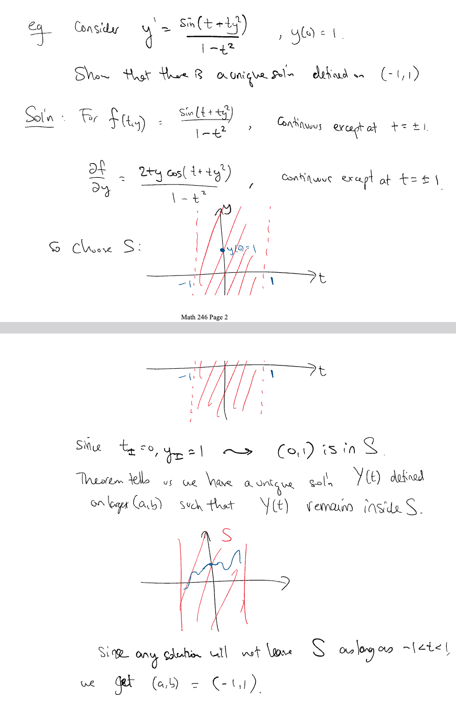

We say that the problem is **well-posed** if
- there is a solution
- the solution is unique
- the solution depends continuously on the data 

Existence and uniqueness theorem:
Consider a set $S$ of points in the $(t, y)$ plane.
If **$f(t, y)$ is continuous on $S$**, and **$\frac{\partial f}{\partial y}$ is continuous on S**, then for any $(t_I,y_I)$ in S, there is a unique continuous solution $Y(t)$ to $y' = f(t,y)$, $y(t_I) = y_I$ defined over some interval $(a, b)$ containing $t_I$.
> 

***
