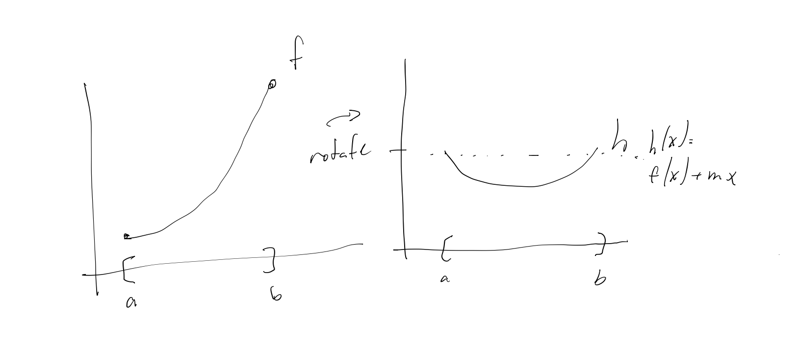
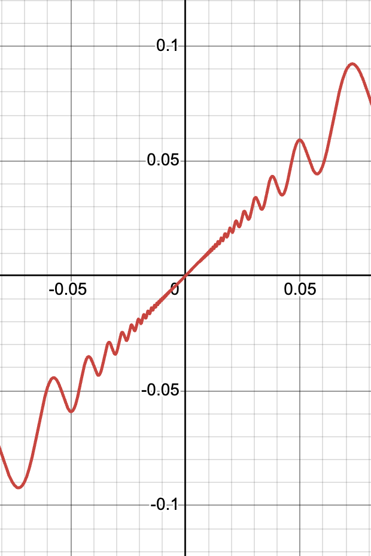

**Mean Value Theorem::Theorem Name**
Let **$f$ be continuous on $[a,b]$ and differentiable on $(a,b)$**. Then **there exists a number $c$ in $(a,b)$ such that $f'(c) = \frac{f(b) - f(a)}{b - a}$**.
+
Proof:
We want to **transform $f$ such that the endpoints of $f(x)$ are equal to apply Rolle's theorem**.
**Create the function $h(x) = f(x) + mx$ for some $m \in \mathbb{R}$**
**Set $h(a) = h(b)$, so $f(a) + ma = f(b) + mb$** 
Rearranging, **6::$m(a-b) = f(b) - f(a)$**
So $m = **6::-\frac{f(b) - f(a)}{b - a}**$ 
Applying **Rolle's Theorem to $h(x)$**, we get:
**$\exists x_0 \in (a,b)$ such that $h'(x_0) = 0$** 
After some algebra, we get the result.
> 
> note that $x_0$ is not necessarily unique
> $h'(x_0) = f'(x_0) + m = 0$ 
> $\implies f'(x_0) = -m = \frac{f(b) - f(a)}{b - a}$

Theorem: Suppose **$f: (a, b) \rightarrow \mathbb{R}$. If $|f'(x)| \leq M$ for all $x \in (a, b)$**, then **$f$ is Lipschitz**
Proof:
**take $x,y \in (a,b)$**
**2::$\exists x_0 (a,b)$ such that $f'(x_0) = \frac{f(y) - f(x)}{y - x}, x \neq y$** 
**2::$\implies|f(y)-f(x)\leq|f(x_0)||(y-x)\leq M|y-x|$** 
> eg $f = \cos$, so $|\cos{(x)} - \cos{(y)}| \leq |x-y|$

Lemma for Rolle's Theorem: 
Let $f: **(a, b) \rightarrow \mathbb{R}**$ be differentiable. Then if **$x_0 \in (a,b)$ and $f(x_0)$ is a relative maximum or minimum**, **$f'(x_0) = 0$**.
+
Proof: 
WLOG, suppose $f(x_0)$ is a relative maximum. 
Then, **$\frac{f(x) - f(x_0)}{x - x_0} \geq 0$ for all $x \in (a,b)$, $x < x_0$**, so **$f'(x_0)=\lim_{x\to x_0,x<x_0}\frac{f(x)-f(x_0)}{x-x_0}\geq0$**.
Similarly, **$f'(x_0)=\lim_{x\to x_0,x>x_0}\frac{f(x)-f(x_0)}{x-x_0}\leq0$**.
Thus, $f'(x_0) = 0$.

**Roll's Theorem::Theorem Name** 
Let $f$ be **continuous on $[a,b]$ and differentiable on $(a,b)$**. **If $f(a) = f(b)$**, then **there exists a number $c$ in $(a,b)$ such that $f'(c) = 0$**.
+
Proof:
By EVT, **$f$ attains a maximum and minimum on $[a,b]$**.
Case 1: **the max/min are both on the boundary**
Then, **$f$ is constant on $[a,b]$, so $f'(c) = 0$ for all $c \in (a,b)$**.
Case 2: **5::the max/min are not on the boundary**
Then, **$f$ attains a max/min at some $c \in (a,b)$**.
By the lemma, **$f'(c) = 0$**.
Let $f: (a, b) \rightarrow \mathbb{R}$ be differentiable. Then if $x_0 \in (a,b)$ and $f(x_0)$ is a relative maximum or minimum, $f'(x_0) = 0$.

Corollary to Mean Value Theorem:
$f: I \rightarrow \mathbb{R}$, $I$ is an open interval, and $f'(x)$ exists. Then, **$f$ is constant on $I$** if and only if **$f'(x) = 0$ for all $x \in I$**.
+
Proof:
Forward direction: 
Trivial
Reverse direction:
**Suppose BWOC that $f$ is not constant. Then $f(x) \neq f(y)$ for some $x \neq y$. By MVT, $\exists x_0$ such that $f'(x_0) = \frac{f(x) - f(y)}{x - y}$, but $\frac{f(x) - f(y)}{x - y} \neq 0$, so $f'(x_0) \neq 0$. Contradiction, thus $f$ is constant.** 

Corollary to Mean Value Theorem: 
Let $f$ and $g$ be differentiable on an open interval $I$. Thus, **$f'(x) = g'(x)$ for all $x \in I$ if and only if $f(x) = g(x) + C$ for some constant $C$**.
+
Proof: 
**Define $h(x) = f(x) - g(x)$. Then, $h'(x) = f'(x) - g'(x) = 0$ for all $x \in I$. By the previous corollary, $h(x) = C$ for some constant $C$. Thus, $f(x) = g(x) + C$.** 
> Previous corollary: $f: I \rightarrow \mathbb{R}$, $I$ is an open interval, and $f'(x)$ exists. Then, $f$ is constant on $I$ if and only if $f'(x) = 0$ for all $x \in I$.
> This is used later for antiderivatives

Corollary to Mean Value Theorem:
Let $f$ be **continuous** on $[a,b]$ and **1::differentiable** on $(a,b)$. If **$f'(x) > 0$ on $(a,b)$**, then **$f$ is strictly increasing on $[a, b]$**
> if $f < 0$, then $f$ is strictly decreasing
> consider $f(x)=\begin{cases}x+4x^{2}\sin(\frac{1}{x}) && x\neq 0\\0 && x = 0\end{cases}$
> Then $f'(0) > 0$, but $f$ is not strictly increasing
> 

