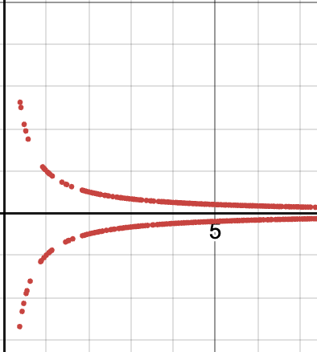

$**\limsup\limits_{n \rightarrow \infty}{x_n}** = **\inf\limits_{n \geq 1}\left(\sup\limits_{k \geq n}x_k\right)**$
> 
> can be thought of as $\lim\limits_{n \rightarrow \infty} \overline{x_n}$, where $\overline{x_n} := \sup\limits_{k \geq n}{x_k}$
> limit of the "sup of the tail" of the sequence

$**\liminf\limits_{n \rightarrow \infty}{x_n}** = **\sup\limits_{n \geq 1}\left(\inf\limits_{k \geq n}x_k\right)**$
> 
> can be thought of as $\lim\limits_{n \rightarrow \infty} \underline{x_n}$, where $\underline{x_n} := \inf\limits_{k \geq n}{x_k}$
> limit of the "inf of the tail" of the sequence

Example: 
$x_n = (-1)^n$ has $\limsup = **1**$ and $\liminf = **c1::-1**$

$\overline{x_n} := \sup\limits_{k \geq n}{x_k}$
The limit of $\{\overline{x_n}\}$ exists because:
We assume that $\{\overline{x_n}\}$ is bounded below.
It is also **monotonically decreasing** because **1::$\overline{x_{n+1}} \leq \overline{x_n}$**.
Thus by **Monotone Convergence Theorem**, it converges
> in fact, $\overline{x_n} \rightarrow \inf\limits_{n \geq 1}{\overline{x_n}}$
> \* consider $S_n = \{x_n, x_{n+1}, x_{n+2}, \ldots\}$, then $S_{n+1} \subseteq S_n$
> so $\sup S_{n+1} \leq \sup S_n$
> $A \subseteq B$, so $\sup A \leq \sup B$

Theorem: 
Limit of $\{x_n\}$ is $L \iff **\limsup\limits_{n \rightarrow \infty} x_n = \liminf\limits_{n \rightarrow \infty} x_n = L**$
> eg $\{\frac{(-1)^n}{n}\}$
> 

Example:
$x_n = \frac{(-1)^n}{n}$
$\limsup = **0**$
> $\overline{x_{n}}:=\sup_{k\geq n}x_{k}=\begin{cases}\frac{1}{n}&n\mathrm{~even}\\\frac{1}{n+1}&n\mathrm{~odd}\end{cases} \rightarrow 0 \mathrm{~as~} n \rightarrow \infty$

Example:
$x_n = \frac{(-1)^n}{n}$
$\liminf = **0**$
> $\underline{x_{n}}:=\inf_{k\geq n}x_{k}=\begin{cases}\frac{-1}{n+1}&n\mathrm{~even}\\-\frac{1}{n}&n\mathrm{~odd}\end{cases} \rightarrow 0 \mathrm{~as~} n \rightarrow \infty$

Definition:
The **limit set**, $S$, of a sequence $\{x_n\}$ is **$S = \{x | \exists x_{n_k} \rightarrow x\}$** 
> note that x_n itself does not have to converge. Thus S may contain multiple elements

Theorem:
$S$ is the limit set
$\limsup\limits_{n \rightarrow \infty} x_n = **\sup S**$
$\liminf\limits_{n \rightarrow \infty} x_n = **1::\inf S**$
> Proof is skipped
> Example: 
> $x_n = (-1)^n$
> Limit set is $\{-1, 1\}$, so $\limsup = 1$ and $\liminf = -1$
> Example:
> $x_n = \frac{(-1)^n}{n}$
> Limit set is $\{0\}$, so $\limsup = 0$ and $\liminf = 0$

Theorem:
$\limsup(x_n + y_n) **\leq \limsup(x_n) + \limsup(y_n)**$
$\liminf(x_n + y_n) **1::\geq \liminf(x_n) + \liminf(y_n)**$
Proof for 1:
**$x_n + y_n \leq \sup\limits_{k \geq n}x_k + \sup\limits_{k \geq n}y_k$**
**By definition of $\sup$, $\sup\limits_{k \geq n}\left(x_k + y_k\right) \leq \sup\limits_{k \geq n}x_k + \sup\limits_{k \geq n}y_k$**
**Then take the limit of both sides** to get the desired result.

***