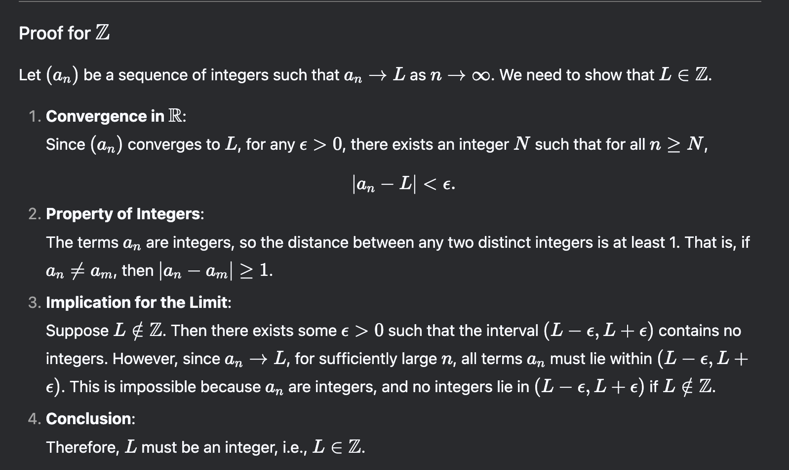

# exam 1

Justin's exam v2 #6, try to solve with EVT

fall 2019 #7
Suppose D is sequentially compact and f : D → R is continuous. Prove that f (D) is  sequentially compact

homework 2, prove that the set of integers is closed.

