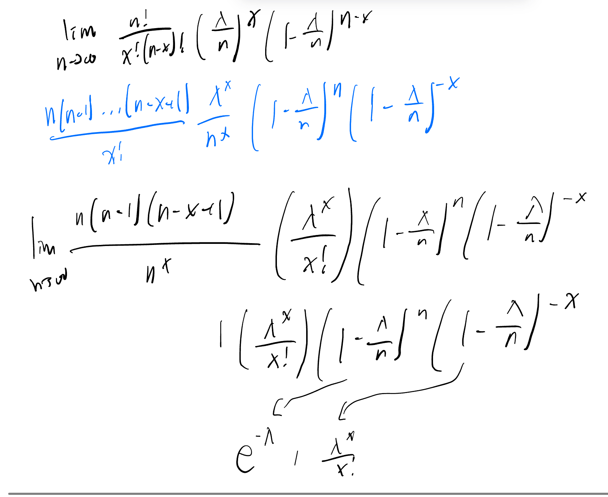

$k$ in the notation $p(x; k)$ indicates that **the distribution depends on the parameter $k$**.
> eg $\displaylines{(x;k)=P(X=x)=\frac1k \\ x=x_1,\ldots,x_k.\\ \mu=E(X)=\frac1k\sum_{i=1}^kx_i  \\ \sigma^2=\text{Var}(X)=\frac1k\sum_{i=1}^k(x_i-\mu)^2}$ 

***

# Poisson distribution

To prove that the Poisson distribution is a valid mass function, take the sum across all values: 
$$\sum_{x=0}^\infty p(x;\lambda)=\sum_{x=0}^\infty\frac{e^{-\lambda}\lambda^x}{x!}=e^{-\lambda}\sum_{x=0}^\infty\frac{\lambda^x}{x!}=e^{-\lambda}e^\lambda=1$$
This simplification involves recognizing the **Taylor series expansion for $e^\lambda$** 

***

Poisson distribution derivation starting point: **$\frac{n!}{x! (n-x)!}\frac{\lambda}{n}^x\left(1-\frac{\lambda}{n}\right)^{n-x}$**
	

˝